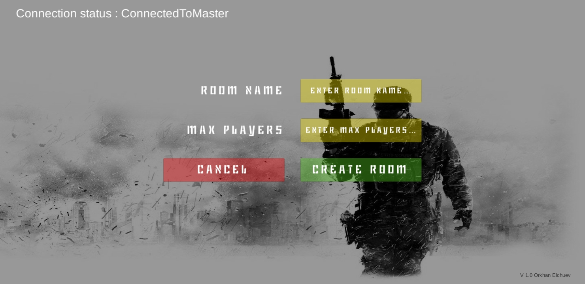

# Island War 
Multiplayer 3D First Person Shooter game for mobile devices using Unity and Photon.
This game was created for learning purposes. Particularly to advance in setting up Multiplayer game via Photon for mobile devices. 
Also to improve in 3D level creation in Unity and handle movement control for mobile devices.

## Screenshots and detailed description
#### Login Scene - Setting up User nickname and manage connection to the Photon Server.

#### Create Room Scene - Creating custom room, with name and maximum player amount.

#### Room List Scene - Joining to existing rooms in the list.

#### Game Play

## Tools used while developing this project
- Unity.
- Visual Studio Code. Coding in C# Programming Language.
- GitBash.
- PUN (Photon Unity Networking).

## How to install?

### Android
- Open Folder Named "Game" in Island-War repository.
- Proceed to Android folder.
- Click on Island_War.apk and download.
- Connect your phone and drag and drop the apk file OR open this page on phone and directly download.
- Find the apk file in your phone's main files folder (My Files). (Try using a search bar if you cant find apk).
- Install the game and player with friends!

## Known Bugs
- Shooting and Dying sound effects are not produced properly.

## Contacts 
- E-mail address orkhan.elchuev@gmail.com
- https://github.com/OrkhanElchuev/Island-War

## Acknowledgements
- [dafont](https://www.dafont.com/de/)
- [LunaPic](https://www6.lunapic.com/editor/)
- [Wallpaper](https://wallpapercave.com/w/wp1943821)
- [Sound Effect 1](https://freesound.org/people/AlineAudio/sounds/416839/) , [Sound Effect 2](https://freesound.org/people/LeMudCrab/sounds/163457/) 
- [Weapon](http://devassets.com/)
- [Model Animation](https://www.mixamo.com/#/)

